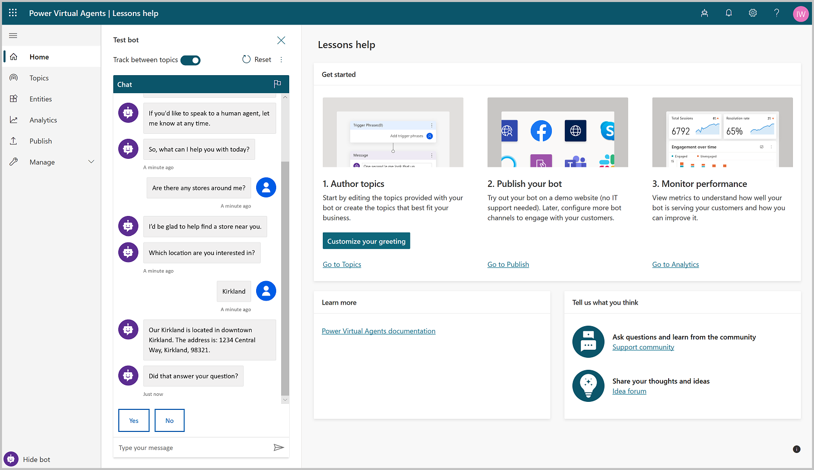
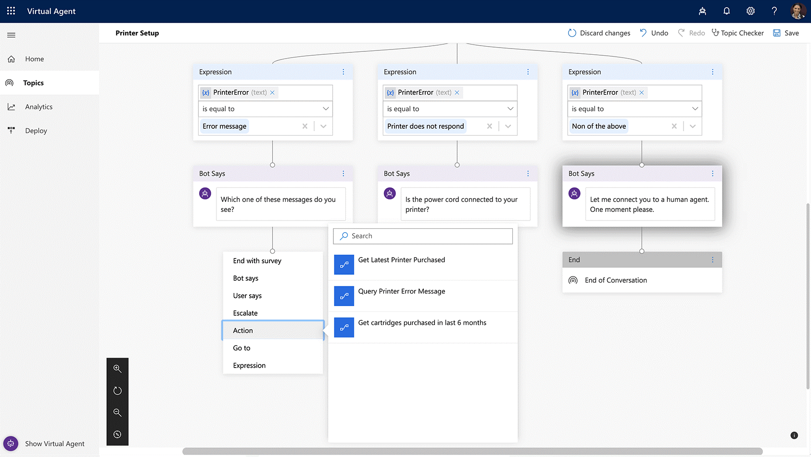
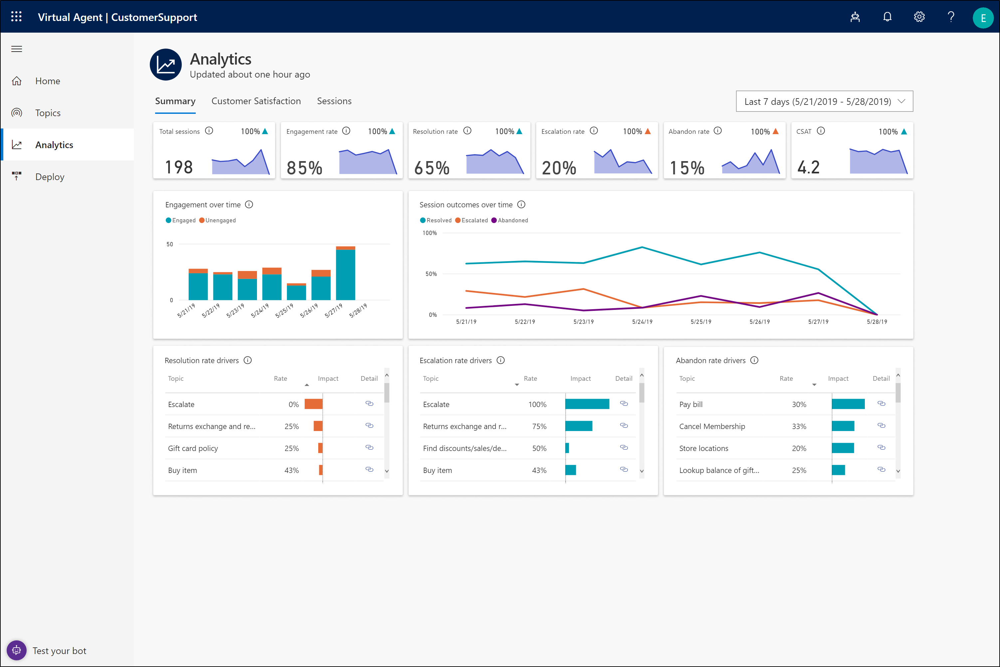

# Dynamics 365 Virtual Agent for Customer Service Preview overview

[!INCLUDE [cc-beta-prerelease-disclaimer](includes/cc-beta-prerelease-disclaimer.md)]

>[!IMPORTANT] 
>This feature is a preview, which means that it is made available to you before general availability so you can test and evaluate the preview and provide feedback to Microsoft. 
>- This preview may employ reduced or different privacy, security, or compliance commitments than a commercial version. As such, this preview is not meant to be used with any "live" or production Customer Data, Personal Data, or other data that is subject to heightened compliance requirements. Any use of "live" data is at your sole risk and it is your sole responsibility to notify your end users that they should not include sensitive information with their use of the Preview.
>- This preview, and any support Microsoft may elect to provide, is provided "as-is," "with all faults," "as available," and without warranty. This preview is subject to the [Preview Agreement](https://go.microsoft.com/fwlink/?linkid=2073931).

Dynamics 365 Virtual Agent for Customer Service empowers customer service teams to easily create powerful bots using a guided, no-code graphical interface without the need for data scientists or developers.
Virtual Agent for Customer Service addresses many of the major issues with bot building in the industry today. It eliminates the gap between the subject matter experts and the development teams building the bots, and the long latency between customer support teams recognizing an issue and updating the bot to address it. It removes the complexity of exposing teams to the nuances of conversational AI and the need to write complex code. And, it minimizes the IT effort required to deploy and maintain a custom conversational solution.

Using Virtual Agent for Customer Service, you can: 
- **Empower your customer service teams** by allowing them to easily build bots themselves without needing intermediaries, or coding or AI expertise.
- **Reduce costs** by easily automating common support inquiries and freeing human agent time to deal with more complex issues.
- **Improve customer satisfaction** by allowing customers to self-help and resolve issues quickly 24/7 using rich personalized bot conversations. 

> [!div class="nextstepaction"]
> [Get started now](https://aka.ms/virtual-agent)

## Highlights of Dynamics 365 Virtual Agent for Customer Service

- **Get started in seconds**. Virtual Agent for Customer Service is a software-as-a-service (SaaS) offering. It allows you to easily sign up, create your bot, and embed it into your website with just a few clicks. There’s no infrastructure to maintain or complex systems to deploy. 

- **Empower your subject matter experts**. Using Virtual Agent, your customer service teams are in the driver's seat. Your SMEs can create bots quickly and easily using a **novel, intuitive, code-free graphical interface**, eliminating the need for AI expertise or teams of developers.

    

3. **Enable rich, natural conversations.** Microsoft’s powerful conversational AI capabilities enable your end users to have rich multi-turn conversations that quickly guide them to the right solution. And, unlike most products on the market, there’s no need to retrain AI models. All you need is to provide a few examples of what topic you want the bot to handle and you’re ready to go.
   
 
4. **Enable bots to take action.** Bots that can chat with your users are great, but bots that can act on their behalf are even better. With Virtual Agent for Customer Service, you can easily integrate with services and backend systems out-of-the-box or through hundreds of easy-to-add custom connectors using Microsoft Flow. This makes it simple to create a bot that not only responds to the user, but also takes action to resolve their issues.
 
    

5. **Monitor and improve bot performance.** Virtual Agent for Customer Service lets you keep an eye on how your bots are performing using powerful metrics and AI-driven dashboards. Easily see which topics are doing well and where the bot can improve, and quickly make adjustments to improve performance.  

    

6. **Better together.** Virtual Agent for Customer Service works hand-in-hand with [Dynamics 365 for Customer Service Insights](https://dynamics.microsoft.com/en-us/ai/customer-service-insights) to provide a holistic view of your customer service operations. You can use Customer Service Insights and Virtual Agent together to determine which topics are trending or consuming support resources, and then easily automate them.

## Helpful links

[Creating a bot](getting-started-create-bot.md)

[Creating custom topics for your bot](getting-started-create-topics.md)

[Deploying your bot](getting-started-deploy.md)

[Using analytics to improve your bot](getting-started-analytics.md)

[Working with Virtual Agent](getting-started-bot-designer.md)

[Deleting a bot](getting-started-delete-bot.md)
