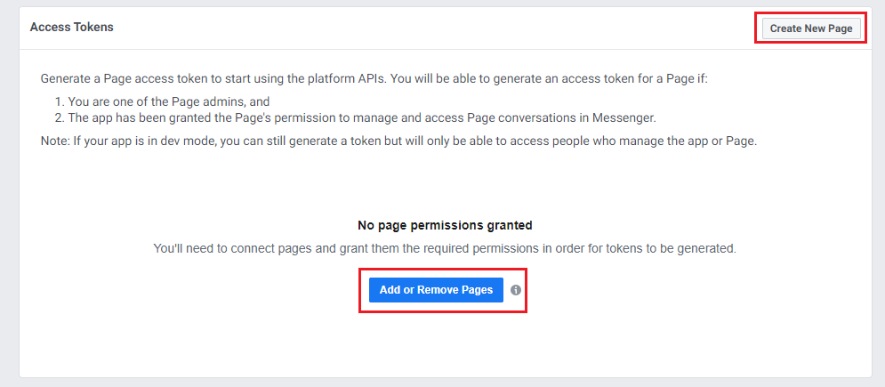
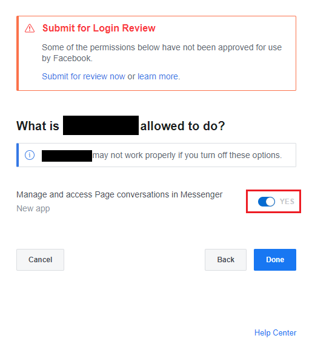
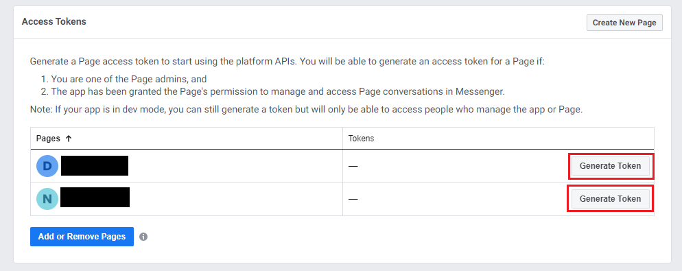
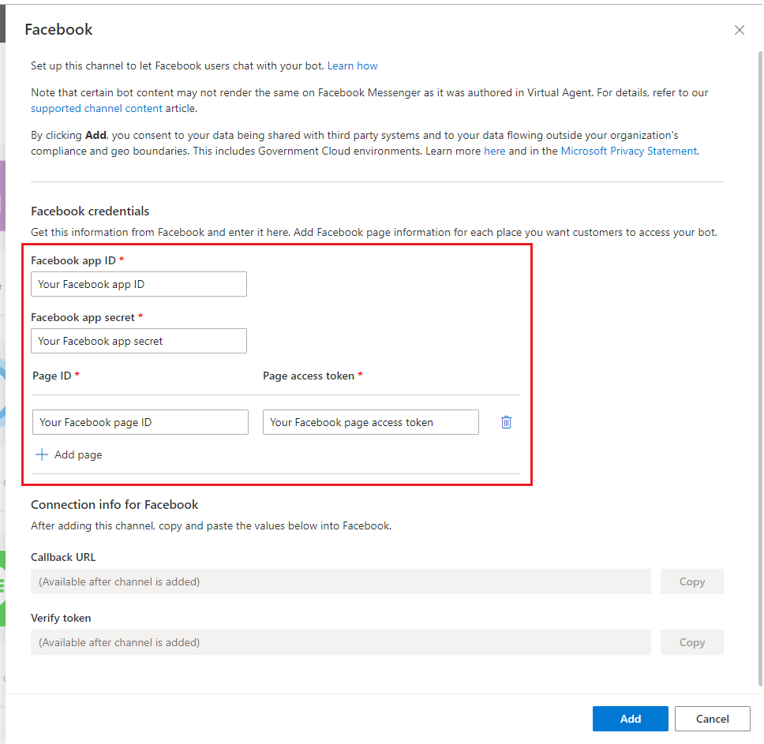
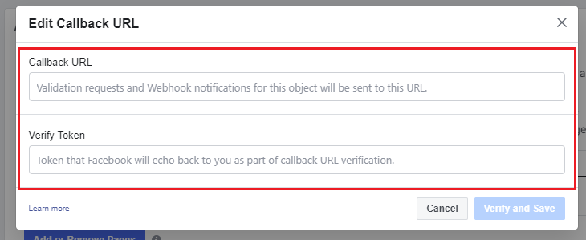
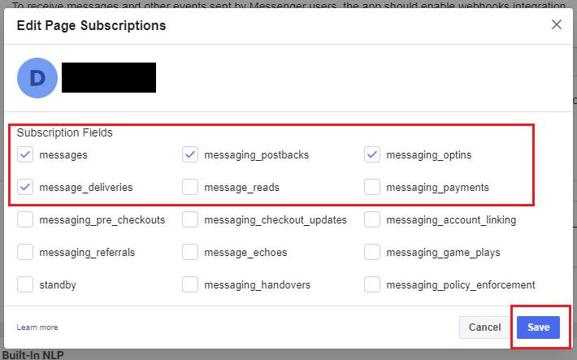
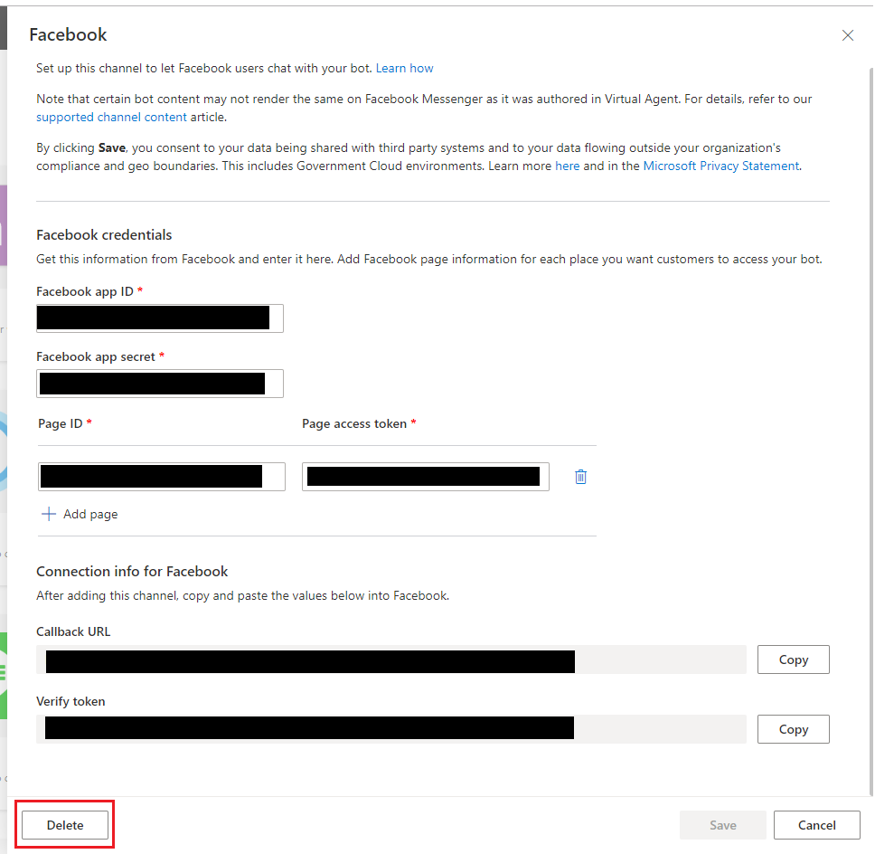

# Add bot to Facebook

[!INCLUDE [cc-beta-prerelease-disclaimer](includes/cc-beta-prerelease-disclaimer.md)]

You can add your bot to either Facebook Messenger or Facebook Workplace to use the Facebook experience to engage with your end users.

Facebook Messenger, Facebook Workplace, and related services are subject to Facebook's own terms and conditions.  For support related to Facebook Messenger and Facebook Workplace, contact Facebook directly.

> [!IMPORTANT]
> This article is intended for experienced IT professionals who manage your organization's Facebook page and Facebook Workplace.

> [!NOTE]
> By publishing your bot to a Facebook page, some of your data such as bot content and end-user chat content will be shared with Facebook (meaning that your data will flow outside of your [organization’s compliance and geographic or regional boundaries](data-location.md)).  
> For more information, see [Facebook's Platform Policies](https://developers.facebook.com/docs/messenger-platform/policy-overview).

## Add bot to Facebook Messenger
You need a Facebook app, and an associated developer account, to connect your Power Virtual Agents bot to Facebook Messenger on your Facebook pages. 

These are the steps involved in this process:

1. Configure Facebook app settings: retrieve your Facebook app information, enable API access, add Facebook Messenger to your app, and configure the Facebook pages your app should appear on.

2. Configure the Facebook publication channel in Power Virtual Agents.

3. Connect your Facebook app to Power Virtual Agents (by using webhooks).

You will then need to submit your app for Facebook review before you can publish your app and make it public. 

### Configure Facebook app settings

**Retrieve Facebook app information:**

1. Sign in to the Facebook app that you want to add your bot to at [Facebook for Developers](https://developers.facebook.com/).

1. Under **Settings** on the side menu panel, select **Basic** . 

3. Copy the *App ID* and *App Secret*. You will need these when you [configure the Facebook channel in Power Virtual Agents](#configure-the-facebook-channel-in-power-virtual-agents).

   

**Enable API access for your Facebook app:**

1. Sign in to the Facebook app that you want to add your bot to at [Facebook for Developers](https://developers.facebook.com/).

1. Under **Settings** on the side menu panel, select **Advanced**. 

2. Make sure **Allow API Access to App Settings** is set to **Yes**.  

4. Select **Save Changes** to confirm your changes.

   

**Add Facebook Messenger to your app:**

1. Sign in to the Facebook app that you want to add your bot to at [Facebook for Developers](https://developers.facebook.com/).

2. Go to the **Dashboard**. Under the **Add a Product** section, select **Set Up** on the **Messenger** tile.

   

**Configure Facebook pages:**

1. Sign in to the Facebook App that you want to add your bot to at [Facebook for Developers](https://developers.facebook.com/).

2. Select **Settings** under **Products** and **Messenger** on the side menu panel.

3. Add the pages you want to add the bot to by selecting **Add or Remove Pages** under the **Access Tokens** section. You can also create a new page by selecting **Create New Page**.

   

4. When adding pages, make sure **Manage and access Page conversations in Messenger** is set to **Yes**.

   

5. Copy the *Page ID* and *Token* for each of the pages that you want to add the bot to.  You'll need to select **Generate Token** for each page. You'll need these when you [configure the Facebook channel in Power Virtual Agents](#configure-the-facebook-channel-in-power-virtual-agents).

   

### Configure the Facebook channel in Power Virtual Agents

1. In Power Virtual Agents, select **Manage** on the side navigation pane, and then go to the **Channels** tab. 

2. Select the **Facebook** tile to open the configuration window.

   

3. Paste the *App ID*, *App Secret*, *Page ID*, and *Token* you retrieved earlier into their corresponding fields.

   

4. At least one page is required, but you can select **Add Page** to add additional pages.

   

5. Select **Add** and wait for the success confirmation message. Once successful, copy the *Callback URL* and *Verify token*. You'll need these when you [connect your Facebook app to Power Virtual Agents](#connect-your-facebook-app-to-power-virtual-agents).

   

### Connect your Facebook app to Power Virtual Agents 

1. Sign in to the Facebook app that you want to add your bot to at [Facebook for Developers](https://developers.facebook.com/).

1. Select **Settings** under **Products** and **Messenger** on the side menu panel.

1. Under the **Webhooks** section, select **Add Callback URL**.

   

1. Provide the *Callback URL* and *Verify token* from the [Configure the Facebook channel in Power Virtual Agents](#configure-the-facebook-channel-in-power-virtual-agents) section and select **Verify and Save**.

   

1. Select **Add Subscriptions** for each page that you want to add the bot to.  

   

1. Select the following fields:
    - **messages**
    - **messaging_postbacks**
    - **messaging_optins**
    - **message_deliveries** 

1. Select **Save**.

   

### Submit for Facebook review

You need to submit your app for Facebook review before you can make your Facebook app public.  Facebook requires a Privacy Policy URL and Terms of Service URL.  You need to provide those on the Facebook basic app settings page (after signing in to your app at [Facebook for Developers](https://developers.facebook.com/), select **Basic** under **Settings** on the side menu panel).

The [Code of Conduct](https://investor.fb.com/corporate-governance/code-of-conduct/default.aspx) page contains third-party resources to help create a privacy policy. The [Terms of Service](https://www.facebook.com/terms.php) page contains sample terms to help create an appropriate Terms of Service document.

Facebook has its own [review process](https://developers.facebook.com/docs/messenger-platform/app-review) for apps that are published to Messenger. You can learn more about it at [Sample submissions](https://developers.facebook.com/docs/apps/review/sample-submissions/) and [Common rejection reasons](https://developers.facebook.com/docs/apps/review/common-rejection-reasons/). Your bot will be tested to ensure it is compliant with [Facebook's Platform Policies](https://developers.facebook.com/docs/messenger-platform/policy-overview) before approved by Facebook to become public. 

### Make the app public and publish the page
Until the app is published, it is in [Development Mode](https://developers.facebook.com/docs/apps/managing-development-cycle). The bot will not be public and it will work only for admins, developers, and testers.

After the review is successful, in the app's **Dashboard** under **App Review**, set the app to **Public**. Ensure that the Facebook Page associated with the bot is published. The status appears in the **Pages** settings.

## Add your bot to Facebook Workplace
[Facebook Workplace](https://workplace.facebook.com/help/work/) is the business-to-employee version of Facebook.

To add your bot to Facebook Workplace, you'll need information from your Facebook Workplace Advanced account and Power Virtual Agents. 

You also need to be the administrator of a Facebook Workplace Advanced account to create a custom integration. 

Learn more at [What are the differences between Workplace Standard and Workplace Advanced?](https://www.facebook.com/help/work/289530281467090) and [Facebook Workplace Custom Integrations](https://developers.facebook.com/docs/workplace/custom-integrations-new/).

**Create and connect a custom integration:**

1. Sign in to your [Facebook Workplace Advanced](https://www.facebook.com/workplace) account as the administrator.

2. Select **Admin Panel** on the side menu panel and then **Integrations**. Select **Create Custom Integration**.

   

3. Under **Integration details**, copy and securely store the *App ID*, *App Secret*, and *Access token* (the *Access token* will be used as the page access token). Make sure **Enabled** is set to **Yes**. Under **Integrations Permissions**, make sure **Message any member** is selected.

   

4. Navigate to the custom integration page you created in the previous step. You can do this by searching the custom integration's name on the side search bar. Copy the *page ID* of the custom integration from the URL at *my.workplace.com/\{your-integration-name}-\{pageID}/*.

   

5. Follow the steps under [Configure the Facebook channel in Power Virtual Agents](#configure-the-facebook-channel-in-power-virtual-agents) to provide the custom integration information.

**Set up webhooks for Facebook Workplace custom integration:**
1. Return to your Facebook Workplace custom integration settings by selecting **Admin Panel** on the side menu panel and then the custom integration you created.

2. Under the **Configure Webhooks** section, provide the *Callback URL* and *Verify token* from the [Configure the Facebook channel in Power Virtual Agents](#configure-the-facebook-channel-in-power-virtual-agents) section.  Select the **messages**, **messaging_postbacks**, and **message_deliveries** fields. 

   

3. Save your custom integration by selecting **Save**.

## Remove your bot from Facebook Messenger or Facebook Workplace
When you do not want the bot to be reachable in Facebook Messenger or Facebook Workplace, you can remove the bot from Facebook. 

1. In Power Virtual Agents, select **Manage** on the side navigation pane, and then go to the **Channels** tab. 

1. Select the **Facebook** tile and then **Delete**.

   

## Known limitations
- You will need to create a new bot if the Customer Satisfaction (CSAT) survey shows up as a non-interactable card image for a bot created during public preview to access the latest CSAT content.
- It might take a few minutes before the bot becomes reachable by users on Facebook pages after the Facebook channel is added.
- After removing the Facebook channel, it might take a few minutes before the bot is removed fully and becomes unreachable on Facebook Messenger and Facebook Workplace.
- After removing a Facebook page, it might take a few minutes before the bot becomes unreachable by visitors to the removed page through Facebook Messenger.

