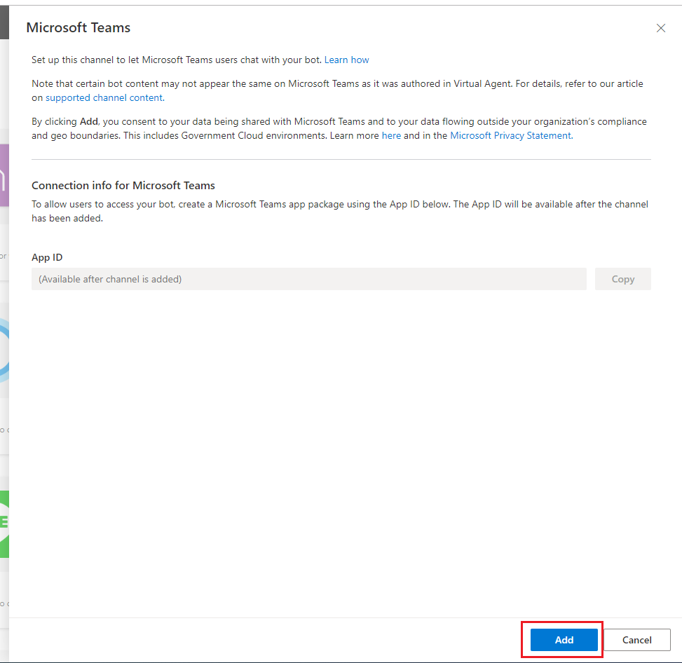
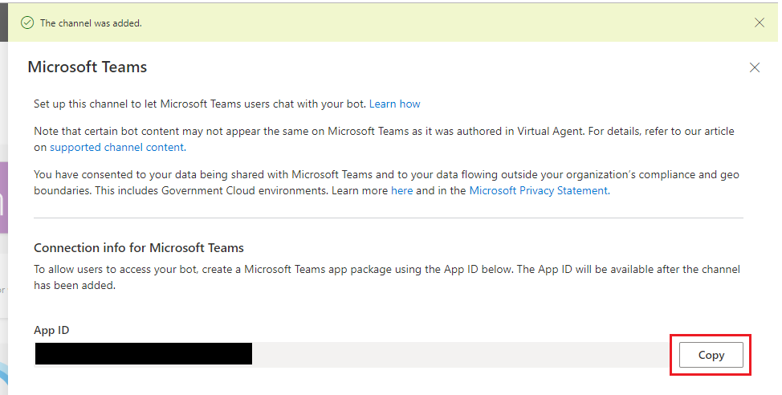

# Add Microsoft Teams channel

[!INCLUDE [cc-beta-prerelease-disclaimer](includes/cc-beta-prerelease-disclaimer.md)]

You can publish your bot to Teams so other members of your organization can interact with your bot. You will need to [publish the bot at least once](publication-fundamentals-publish-channels.md#publish-the-latest-bot-content) before users can interact with the bot on Teams.

You can also delete the bot from Teams when you no longer want people to interact with it there, and you can distribute it as an app package within your Teams tenant.

>[!NOTE]
>By adding the bot to Teams, some of your data, such as bot content and end user chat content, will be shared with Teams (meaning that your data will flow outside of your [organization’s compliance and geographic or regional boundaries](data-location.md).
>For more information, see the [Microsoft Teams app privacy policy](/MicrosoftTeams/app-permissions).

## Add your bot to Teams

1. Select **Manage** on the side navigation pane, and then go to the **Channels** tab.
2. Select **Microsoft Teams**, and then **Add**.

2. After Microsoft Teams is added successfully, copy the *App ID*. You will need this information for later.

3. [Install Microsoft Teams App Studio](/microsoftteams/platform/get-started/get-started-app-studio) and launch it in Microsoft Teams. Alternatively, you can also [directly create your application's manifest](/microsoftteams/platform/resources/schema/manifest-schema).

4. In App Studio, select **Manifest Editor** and then **Create a new app**.

5. Enter the necessary information about your bot and organization on the **App details** screen, and then select **Bots** on the side menu. 

6. Select **Set up**, then **Existing bot**, and enter the bot's name.

7. Select **Connect to a different bot id** and pste the App ID you copied earlier. Under **Scope:**, select **Personal**. Click **Save**.

7. This step is only requird if your bot requires an end user to sign in. Click **Domains and Permissions** and add *Token.botframework.com* under **Valid domains** section.

8. Click **Test and distribute** to install the app directly to your Microsoft Teams instance, or download the app package to share with your teammates.

After installing the app package, you will automatically start a chat with the bot on Teams.

## Remove your bot from Teams

1. Select **Manage** on the side navigation pane, and then go to the **Channels** tab.
2. Select **Microsoft Teams**, and then **Delete**.

>[!NOTE]
>You cannot remove your bot from Teams if you have set up Dynamics 365 Omnichannel for Customer Service with your bot. 
>You must [remove the Omnichannel for Customer Service configuration](configuration-hand-off-omnichannel.md#remove-omnichannel-connection) before you can remove the Teams publication channel. 

## Distribute your Teams bot##

In addition to directly installing the Microsoft Teams app package, you can use Teams to [distribute the app within your tenant](/microsoftteams/tenant-apps-catalog-teams) and [disitrbute the app publicly](/microsoftteams/platform/publishing/apps-publish). 

## Known limitation
- The icon and name of your bot on Teams is not customizable by Microsoft Teams App Studio when sideloaded and published through the Microsoft Teams Tenant Apps Catalog. The Microsoft Teams App Studio bot icon and name customization will be applied to bots that are published through AppSource. Learn more at [Publishing checklist](/microsoftteams/platform/publishing/office-store-checklist).
- Teams has [rate limiting](/microsoftteams/platform/concepts/bots/rate-limit) on bots. Depending on your business needs, you may want to keep your bot content concise for bots that are added to Teams.
- Currently, if your bot supports [end-user authentication](advanced-end-user-authentication.md), the user will not be able to explicitly sign out. This will fail the Microsoft Teams Appsource certification if you are publishing your bot in the Seller Dashboard. This does not apply to personal or tenant usage of the bot. Learn more at [Publish your Microsoft Teams app](/microsoftteams/platform/publishing/apps-publish) and [Appsource Validation Policy](/office/dev/store/validation-policies).
- Removing the Teams publication channel may take a few minutes before the bot becomes unreachable by users on Teams.
