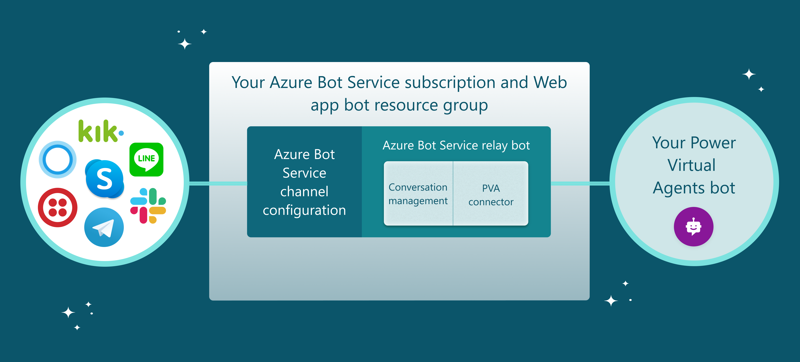
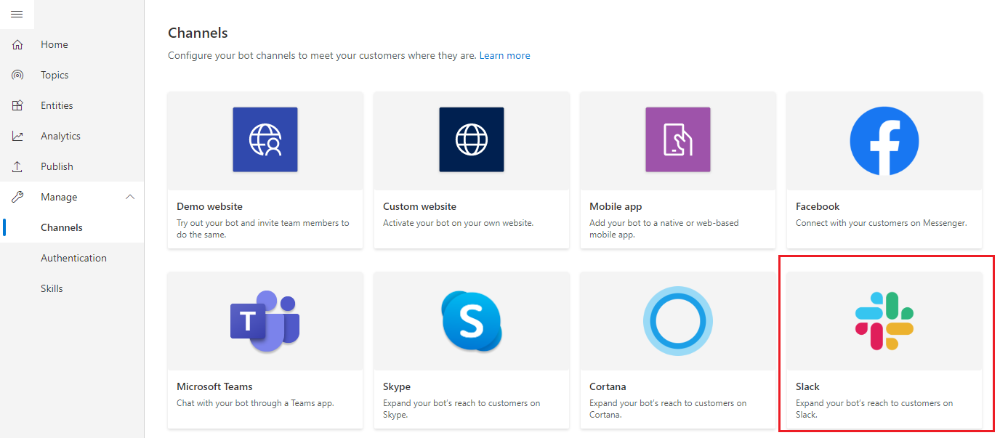
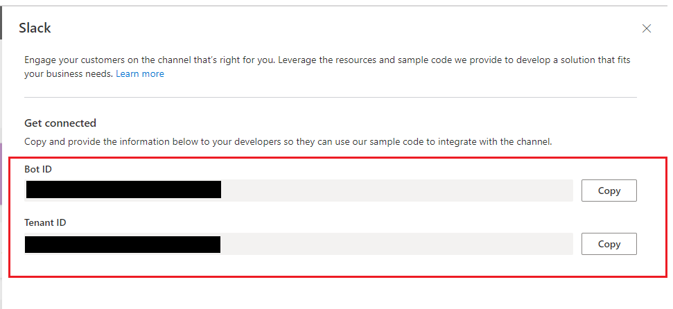

# Add Power Virtual Agent bot to Azure Bot Service channels

[!INCLUDE [cc-beta-prerelease-disclaimer](includes/cc-beta-prerelease-disclaimer.md)]

You can connect your bot to existing [Azure Bot Service channels](/azure/bot-service/bot-service-manage-channels?view=azure-bot-service-4.0). This can be helpful if you want to connect your bot to end users on Azure Bot Service channels. 

Adding your bot to Azure Bot Service channels requires considerable developer expertise. This topic is written for IT admins or developers who have experience developing and writing code.


> [!TIP]
> You do not need to follow this document to add your Power Virtual Agents bot to your [website, Facebook, or Microsoft Teams](publication-fundamentals-publish-channels.md).
>If your goal is to connect to a custom web-based or native app, your developers can learn more at [Add bot to mobile and custom apps](publication-connect-bot-to-custom-application.md).

> [!IMPORTANT]
> Instructions in this section require software development from you or your developers. It is intended for experienced IT professionals, such as IT admins or developers who have a solid understanding of developer tools, utilities, and IDEs.

## Prerequisites

- An [Azure Bot Service subscription](https://azure.microsoft.com/services/bot-service/).
- An Azure Bot Service bot using v4 SDK.
- [.NET Core SDK](https://dotnet.microsoft.com/download) version 2.1.
- Nuget package [Microsoft.Bot.Connector.DirectLine](https://www.nuget.org/packages/Microsoft.Bot.Connector.DirectLine).
- A bot created in Power Virtual Agents that you want to connect to an Azure Bot Service channel.
- [!INCLUDE [Medical and emergency usage](includes/pva-usage-limitations.md)]


You should also read [Connect your bot to mobile and custom apps](publication-connect-bot-to-custom-application.md) before following the instructions in this topic.

### Code samples
Code snippets used in this document are from [relay bot sample code](https://github.com/microsoft/PowerVirtualAgentsSamples/tree/master/RelayBotSample).  

### References
The instructions in this document reference the following:
- [Deploy your bot to Azure](https://aka.ms/azuredeployment) for instructions on deploying the Azure Bot Service bot.
- [Azure Bot Service Channels](/azure/bot-service/bot-service-manage-channels?view=azure-bot-service-4.0) to connect to any Azure Bot Service-supported channel.
- [Azure Bot Service debug with the emulator](/azure/bot-service/bot-service-debug-emulator?view=azure-bot-service-4.0&tabs=csharp) for instructions on debugging the Azure Bot Service bot.

## Create or use an existing Azure Bot Service bot
You need an Azure Bot Service bot that can relay conversations between your Power Virtual Agents bot and Azure Bot Service channels.



The [relay bot sample code](https://github.com/microsoft/PowerVirtualAgentsSamples/tree/master/RelayBotSample) is a good starting point if you do not have an existing Azure Bot Service bot. It is built from Microsoft Bot Framework bot [sample code](https://github.com/microsoft/BotBuilder-Samples/tree/master/samples/csharp_dotnetcore) that can be compiled and deployed to the Azure Bot Service. The sample code is meant to be used as a starting point and not intended to be used in production directly. You will need to add code and optimization to match your business needs.  

If you already have an Azure Bot Service bot, you need to add a Power Virtual Agents connector and code to manage conversation sessions.  You can then deploy the bot to the Azure Bot Service and connect to channels with the Azure portal.

## Get your Power Virtual Agents bot parameters
To connect to the bot you have built with Power Virtual Agents, you will need to retrieve your bot's name, bot ID and tenant ID to identify it.

1. Copy your bot's name in Power Virtual Agents.

   

3. Select **Manage** on the side navigation pane, and then go to **Channels**.

2. Select the channel you want to connect to. This topic uses Slack as an example.

   

3. Copy and save the *Bot ID* and *Tenant ID* value by selecting **Copy**. You will need these when connecting your bot to the Azure Bot Service channel.

   

## Manage conversation sessions with your Power Virtual Agents bot
There can be multiple conversations between the Azure Bot Service channels and the Direct Line connection with your Power Virtual Agents bot. 

Your Azure Bot Service bot will need to map and relay the conversation from the Azure Bot Service channel to the Direct Line conversation with the Power Virtual Agents bot and vice versa.


### Sample code example
The following example uses samples from the [relay bot sample code](https://github.com/microsoft/PowerVirtualAgentsSamples/tree/master/RelayBotSample).  


1. On every new external Azure Bot Service channel conversation start, start a Power Virtual Agents conversation. Refer to [Get Direct Line token](publication-connect-bot-to-custom-application.md#get-direct-line-token) and [Use Direct Line to communicate with the bot](publication-connect-bot-to-custom-application.md#use-direct-line-to-communicate-with-the-bot) for instructions on starting a new conversation with the bot.

    ```C#
    using (var httpRequest = new HttpRequestMessage())
    {   
        httpRequest.Method = HttpMethod.Get;
        UriBuilder uriBuilder = new UriBuilder(TokenEndPoint);
        uriBuilder.Query = $"botId={BotId}&tenantId={TenantId}";
        httpRequest.RequestUri = uriBuilder.Uri;
        using (var response = await s_httpClient.SendAsync(httpRequest))
        {
            var responseString = await response.Content.ReadAsStringAsync();
            string token = SafeJsonConvert.DeserializeObject<DirectLineToken>(responseString).Token;
        }
    }

    /// <summary>
    /// class for serialization/deserialization DirectLineToken
    /// </summary>
    public class DirectLineToken
    {
        public string Token { get; set; }
    }
    ```

    ```C#
     // Use the retrieved token to create a DirectLineClient instance
     using (var directLineClient = new DirectLineClient(token))
     {
         var conversation = await directLineClient.Conversations.StartConversationAsync();
         string conversationtId = conversation.ConversationId;
     }
    ```


2. To manage multiple sessions, you need to maintain a mapping of external Azure Bot Service channel conversations to corresponding Power Virtual Agents conversations. A Power Virtual Agents conversation can be identified with and connected with two properties: `ConversationtId` and `Token`.


    ```C#
    Dictionary<string, PowerVirtualAgentsConversation> ConversationRouter = new Dictionary<string, PowerVirtualAgentsConversation>();  
    
    ```

    To manage the conversation lifecycle, you could refresh the Direct Line tokens or clean up idled conversations. You can learn more about token refresh at [Refresh Direct Line token](publication-connect-bot-to-custom-application.md#refresh-direct-line-token).  A Power Virtual Agents conversation to support those is defined as following:
  
    ```C#
    /// <summary>
    /// Data model class for Power Virtual Agents conversation
    /// </summary>
    public class PowerVirtualAgentsConversation
    {
        public string ConversationtId { get; set; } // The Power Virtual Agent conversation ID retrieved from step 1

        public string Token { get; set; } // The DirectLine token retrieved from step 1

        public string WaterMark { get; set; } // Identify turn in a conversation

        public DateTime LastTokenRefreshTime { get; set; } = DateTime.Now; // Timestamp of last token refresh

        public DateTime LastConversationUpdateTime { get; set; } = DateTime.Now; // Timestamp of last active user message sent to bot
    }
    ```

3. When a new Power Virtual Agents conversation starts, add a key value pair (external_Azure_Bot_Service_channel_conversationID, PowerVirtualAgentsConversation) to the mapping table.

    ```C#
    // After new Power Virtual Agents conversation starts
    ConversationRouter[external_Azure_Bot_Service_channel_conversationID] = new PowerVirtualAgentsConversation()
      {
        Token = token,
        ConversationtId = conversationId,
        WaterMark = null,
        LastConversationUpdateTime = DateTime.Now,
        LastTokenRefreshTime = DateTime.Now,
      }; 
    ```

4. To continue on an existing conversation, upon a new external Azure Bot Service channel message received, retrieve the existing conversation from the mapping table, relay the external conversation activity to your Power Virtual Agents bot, and get a response.

    The following sample shows relaying conversation by overriding the [ActivityHandler.OnMessageActivityAsync((ITurnContext<IMessageActivity>, CancellationToken) method](/dotnet/api/microsoft.bot.builder.activityhandler.onmessageactivityasync?view=botbuilder-dotnet-stable)

    ```C#
    // Invoked when a message activity is received from the user
    // Send the user message to Power Virtual Agents bot and get response
    protected override async Task OnMessageActivityAsync(ITurnContext<IMessageActivity> turnContext, CancellationToken cancellationToken)
    {
        // Retrieve bot conversation from mapping table
        // If not exists for the given external conversation ID, start a new Power Virtual Agents conversation
        ConversationRouter.TryGetValue(externalCID, out PowerVirtualAgentsConversation currentConversation) ?
                currentConversation : /*await StartBotConversationAsync(externalCID)*/;
                
        // Create DirectLine client with the token associated to current conversation
        DirectLineClient client = new DirectLineClient(currentConversation.Token);

        // Send user message using directlineClient
        await client.Conversations.PostActivityAsync(currentConversation.ConversationtId, new DirectLineActivity()
        {
          Type = DirectLineActivityTypes.Message,
          From = new ChannelAccount { Id = turnContext.Activity.From.Id, Name = turnContext.Activity.From.Name },
          Text = turnContext.Activity.Text,
          TextFormat = turnContext.Activity.TextFormat,
          Locale = turnContext.Activity.Locale,
        });

        // Update LastConversationUpdateTime for session management
        currentConversation.LastConversationUpdateTime = DateTime.Now;
    }  
    ```

5. Refer to [Use Direct Line to communicate with the bot](publication-connect-bot-to-custom-application.md#use-direct-line-to-communicate-with-the-bot) for how to get the Power Virtual Agents bot's response. When the Power Virtual Agents bot's response is received, refer to [Parse conversation payload from the bot](publication-connect-bot-to-custom-application.md#parse-conversation-payload-from-the-bot) for how to parse the response to the external Azure Bot Service channel response.

An example of response parsing can be found in the [relay bot sample code](https://github.com/microsoft/PowerVirtualAgentsSamples/tree/master/RelayBotSample) ResponseConverter.cs.

## Deploy to Azure Bot Service
After you have your Azure Bot Service relay bot ready, you need to [deploy the bot to your Azure Bot Service](https://aka.ms/azuredeployment). 


## Set up Azure Bot Service channels
You can set up the channels you want to connect to by signing in to the Azure portal and selecting the Azure Bot Service resource group you have deployed to. View the specific instructions for each channel at [Azure Bot Service Channels](/azure/bot-service/bot-service-manage-channels?view=azure-bot-service-4.0).

