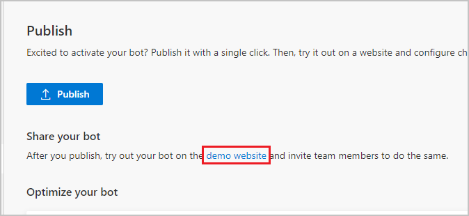

# Fundamentals - Publish your bot

[!INCLUDE [cc-beta-prerelease-disclaimer](includes/cc-beta-prerelease-disclaimer.md)]

With Power Virtual Agents, you can publish bots to engage with your customers on multiple platforms or channels. These include live websites, mobile apps, and messaging platforms like Microsoft Teams and Facebook. 

Once you've done at least one initial publish, you can connect your bot to additional channels. 

When you want to update your bot, you publish it again from within the Power Virtual Agents app itself. This will update the bot across all the channels where you've inserted or connected your bot.

## Publish the latest bot content

You need to publish the bot at least one time before your customers can interact with it or you can share it with your teammates. 

After the first publish, you can do subsequent publishes whenever you would like your customers to engage with the latest bot content.

**Publish the latest bot content:**

1. Go to the **Publish** tab on the side navigation pane. 

2. Select **Publish** to make the latest bot content available to your customers.

    

The publishing process will check for errors in the latest bot content.

If publication is successful, you can view the bot in action and share it with your team by selecting the **demo website** link. This is useful to gather feedback from stakeholders involved in the bot. The link will open a new tab and display a prebuilt demo website where you and your team can interact with the bot.

Go to the [Configure the demo website and add the bot to your live website](publication-connect-bot-to-web-channels.md) topic for details on updating the welcome message and help text on the demo website.

> [!TIP]
> **What's the difference between the test chat and the demo website?**  
> The demo website lets you share a URL with other members of your team, or other stakeholders who want to try out the bot. It's not intended for production uses (for example, you shouldn't use it directly with customers).  
> The test chat is intended for bot authors to test how conversation nodes flow and if there are errors.

## Configure channels

After publishing your bot at least once, you can add channels to make the bot reachable by your customers. You can see what channels we currently support by selecting **Manage** and going to the **Channels** tab in the side navigation pane.

Each channel requires different steps and configurations, which can be found in the following topics:

- [Configure the demo website and add the bot to your live website](publication-connect-bot-to-web-channels.md)
- [Add bot to Microsoft Teams](publication-add-bot-to-microsoft-teams.md)
- [Add bot to Facebook Messenger](publication-add-bot-to-facebook.md)
- [Add bot to mobile and custom apps (web-based or native)](publication-connect-bot-to-custom-application.md)
- [Add bot to Azure Bot Service channels](publication-connect-bot-to-azure-bot-service-channels.md)

## Channel experience reference table
Different channels have different end-user experiences. The following table shows the experiences for each channel. You can take the channel experiences into account when optimizing your bot content for specific channels.

 Experience | Website | Microsoft Teams | Facebook
 ---|---|---|---
 [Customer satisfaction survey](getting-started-create-topics.md) | Adaptive card | Text-only | Text-only
 [Multiple-choice options](getting-started-create-topics.md) | Supported | Supported up to 6; learn more at [Microsoft Teams hero card](/microsoftteams/platform/concepts/cards/cards-reference#hero-card) | Supported up to 13; learn more at [Facebook quick replies](https://developers.facebook.com/docs/messenger-platform/send-messages/quick-replies/)
 [Markdown](https://daringfireball.net/projects/markdown/) | Supported | Supported | Partially supported; learn more at [Facebook markdown documentation](https://www.facebook.com/help/147348452522644?helpref=related)
 [Welcome message](getting-started-create-greeting.md) | Supported | Supported | Not supported

