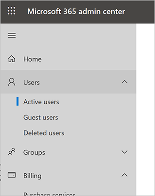

# Assign licenses for Power Virtual Agents

You need an organizational license and a user license to use Power Virtual Agents.

To see the available subscriptions for Power Virtual Agents see the [pricing page](https://go.microsoft.com/fwlink/?linkid=2099502) where you can also download the Microsoft volume licensing guide.

This article focuses on how to assign licenses for Power Virtual Agents to your users.

## Managing licenses using the Microsoft 365 admin center
You can purchase Power Virtual Agents licenses for your organization from the [Microsoft 365 admin center](https://admin.microsoft.com/admin/default.aspx)

**Purchase base and user licenses:**

  > [!Note]
  > If you're not using the new Microsoft 365 admin center, you can turn it on by selecting the **Try the new admin center** toggle located at the top of the Home page.

1. Go to the [Microsoft 365 admin center](https://admin.microsoft.com/admin/default.aspx)

2. On the side navigation pane, expand the **Billing** menu and then select **Purchase services**.

3. Search for and select the subscriptions you want to purchase. On the confirmation screen select the number of licenses you would like to purchase.

4. Complete the check out process.

**Give individual users access:**

1. Go to the [Microsoft 365 admin center](https://admin.microsoft.com/admin/default.aspx)

2. On the side navigation pane, expand the **Users** menu and then select **Active users**.

    

3. Select users to whom you would like to give access and select **Manage product licenses**.

   

4. In the flyout panel that opens, select the checkbox next to **Power Virtual Agents user license**. Select **Save changes**. Repeat these steps to add more users, or exist the Microsoft 365 admin center if you're finished.

  > [!NOTE]
  > To simplify User License management you can assign licenses to an AAD security group. [Learn more](/azure/active-directory/users-groups-roles/licensing-groups-assign)

5. The selected users can now sign in to the [Power Virtual Agents portal](https://powerva.microsoft.com).

## Trial plans
Users in your organization can trial Power Virtual Agents for a limited time period.

You can choose to disable or enable the ability for users in your organization to sign up for a trial by modifying the **AllowAdHocSubscriptions** flag in [your organization settings](/azure/active-directory/users-groups-roles/directory-self-service-signup). 

## Billing unit 
Currently, we only report the total number of sessions in the product. We do not report the number of billed sessions. 

The number of billed sessions will be always lower than the number of sessions. We are working on bringing the number of billed sessions into the product soon.

### Definition of billing unit
A billed session is an interaction between the customer and the bot and represents one unit of consumption. The billed session begins when an authored topic is triggered. A topic ends in one of the following scenarios: 

1. When all of the user's questions are answered.

2. When a user intentionally ends or closes a chat session. For web this means when the user closes the tab with the chat open. For persistent channels such as Microsoft Teams or Facebook, this means the user didn't write any message for more than 30 minutes.

3. When a bot is unable to answer the question adequately and the interaction is [escalated to a live agent](advanced-hand-off.md).

On top of the above scenarios, there are two additional limitations of a billed session:

- One billed session can last 60 minutes at its longest.
- One billed session can contain a maximum of 100 conversational turns (one turn is defined as one exchange between the user and the bot).

Please note that, at the moment, you will be billed even if you chat with the bot in the embedded test chat. 

## Using Power Automate with a Power Virtual Agents license
In order to have unlimited flow runs in Power Automate, you need to create a flow [using the link from within the Power Virtual Agents app](advanced-flow.md). 

Flow runs created using this template do not accrue to your overall Power Automate quotas. 

